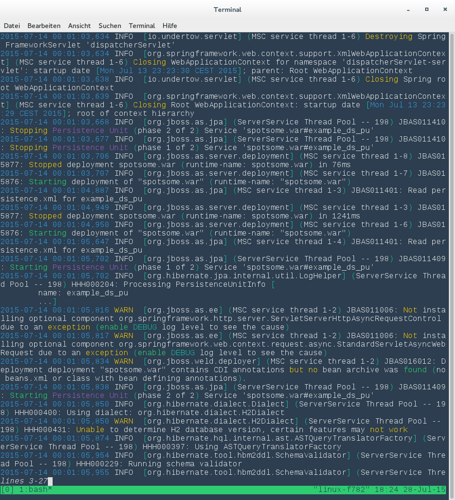

# jcolorize

Read from FILE or stdin, colorize certain keywords and write to stdout.

Especially designed to colorize the log files of Apache Tomcat and Wildfly AS.

	Usage: jcolorize [FILE]

	Examples:
		jcolorize server.log | less [-R]
		cat server.log | jcolorize | less [-R]

##Build

	mvn package -DassembleDirectory=$HOME/opt
	
Add jcolorize to your $PATH:

	export PATH="$PATH:$HOME/opt/jcolorize/bin"

## Requirements
- Java SE 1.7 or higher
- Maven (only for build)
